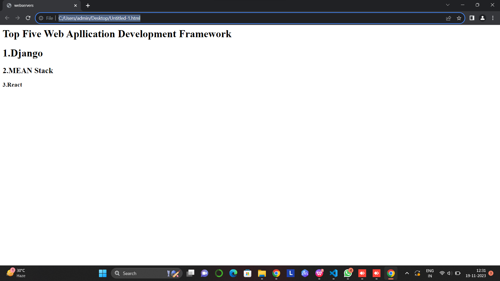

# Developing a Simple Webserver
name:naveen kumar
id:23013536
# AIM:

Develop a webserver to display about top five web application development frameworks.

# DESIGN STEPS:

## Step 1:

HTML content creation is done

## Step 2:

Design of webserver workflow

## Step 3:
    
Implementation using Python code

## Step 4:

Serving the HTML pages.

## Step 5:

Testing the webserver
# PROGRAM:
Type your code here python
``````
from http.server import HTTPServer, BaseHTTPRequestHandler
content = """
content = """
<html>
<head>
<title>webservers</title>
</head>
<body>
<h1>Top Five Web Apllication Development Framework</h1>
<h1>1.Django</h1>
<h2>2.MEAN Stack</h2>
<h3>3.React<h3>
</body>
</html>
"""
class HelloHandler(BaseHTTPRequestHandler):
def do_GET(self):
self.send_response(200)
self.send_header('Content-type', 'text/html; charset=utf-8')
self.end_headers()
self.wfile.write(content.encode())
server_address = ('', 80)
httpd = HTTPServer(server_address, HelloHandler)
httpd.serve_forever()
``````

# OUTPUT:


# RESULT:

The program is executed succesfully
